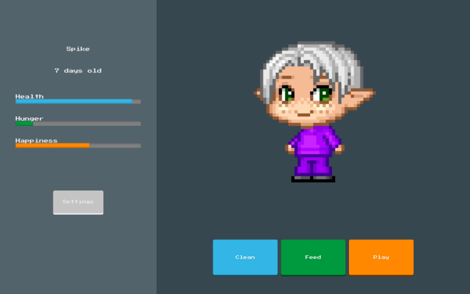

# Chingu Solo Project - Tier 2 - Virtual Pet

## Overview

In this Tier 2 project, you will create a web based tamagotchi inspired virtual pet. As in tier 1, you will create:

- A friendly pet blob with a design of your choosing
- A stats panel health/hunger/happiness
- A set of interaction buttons feed/clean/play
  You will also need to:
- Fetch, process, and display events from our [Virtual Pet Events API](http://www.virtual-pet.uk)
- Implement more advanced logic on pet stats (Health/Hunger/Happiness)

As you build up your skills you’ll be able to return to this project and add in the Tier 3 features.

## Instructions

For this project you May use any Framework of your choosing.

## Requirements

### Structure

You'll need to display the following:

- Sprite (can be as simple or detailed as you like but it should have some expressive facial features)
  - Different sprite versions (i.e. happy/sad/dead...)
- Pet info
  - Name
  - Age
  - Health (0-100)
  - Hunger (0-100)
  - Happiness (0-100)
- Interactions
  - Clean
  - Feed
  - Play
- Game control
  - Speed control
  - Pet name input
  - Game reset button
- End game message
- Event dialog
  - Event title
  - Event description
  - Event type (optional)
  - Event impact (on Health/Hunger/Happiness)

## Functionality

- At every N (i.e. 1000ms, should be updatable via speed control) interval, the 'pet day' should increase by 1

- ### Every pet day:

  - Age should update showing the pet day
  - Health should decrease
  - Hunger should increase
  - Happiness should decrease by a random amount between a set range

- When Health gets to zero the game should end, displaying a message

- ### There should be interactive actions to:

  - Increase health
  - Decrease hunger
  - Increase happiness

  ### Events

  - After 5 'pet days' the app should request it's first event from our [Virtual Pet Events API](http://www.virtual-pet.uk)
  - Each event comes with a nextEvent value. This interger should be added to the apps current pet day to determine when to make the next event request

- ### Advanced logic
  - As the pet gets hungry:
    - The interaction to increase happiness should become less effective
    - Happiness should decrease faster each day
  - As the pet becomes less happy:
    - The interaction to decrease hunger should become less effective
    - Hunger should increase faster each day
  - Hunger and Happinenss should make:
    - The interaction to increase health should become less effective
    - Health should decrease faster each day

## Other

Your repo needs to have a robust README (see Keys to a [Well-Written Readme](https://medium.com/chingu/keys-to-a-well-written-readme-55c53d34fe6d))

## Extras (Not Required)

- Sprite CSS Animations
